# Kernel's Slap — AI coding Mentor Architecture

This document contains the architecture diagram for Kernel's Slap, designed to be copy-pasted directly into your Hackathon article, Dev.to post, or GitHub README.

It uses [Mermaid.js](https://mermaid.js.org/), which renders natively in GitHub, Notion, and Hashnode.

---

## 🏗️ Architecture Diagram

```mermaid
%%{init: {'theme': 'dark', 'themeVariables': { 'primaryColor': '#2d0a4e', 'primaryTextColor': '#e2e8f0', 'primaryBorderColor': '#a855f7', 'lineColor': '#8b5cf6', 'secondaryColor': '#1e293b', 'tertiaryColor': '#0f172a'}}}%%

graph TD
    classDef frontend fill:#1e1e2f,stroke:#a855f7,stroke-width:2px,color:#fff;
    classDef backend fill:#1a202c,stroke:#3b82f6,stroke-width:2px,color:#fff;
    classDef llm fill:#2d3748,stroke:#f59e0b,stroke-width:2px,color:#fff;
    classDef memory fill:#2d1b4e,stroke:#ec4899,stroke-width:2px,color:#fff;
    classDef exec fill:#1c1c1c,stroke:#10b981,stroke-width:2px,color:#fff;
    classDef user fill:#000000,stroke:#ffffff,stroke-width:2px,color:#fff,stroke-dasharray: 5 5;

    %% User Layer
    U((🧑‍💻 User)):::user

    %% Frontend Layer (Next.js)
    subgraph Frontend["🖥️ Frontend Client (Next.js / React)"]
        UI["💻 Interactive Editor<br/>(Monaco)"]:::frontend
        DB["📊 Real-time Dashboard<br/>(Recharts)"]:::frontend
        CH["🎯 Adaptive Challenges<br/>(Fill-in-the-blank)"]:::frontend
    end

    %% Backend Layer (FastAPI)
    subgraph Backend["⚙️ Backend Server (FastAPI / Python)"]
        API["🚦 REST Config / Auth<br/>(FastAPI Router)"]:::backend
        STAT["📈 Local Analytics Stats<br/>(user_stats.json)"]:::backend
        ERR["🔍 Error Detection <br/>(AST / Regex)"]:::backend
    end

    %% External Services Layer
    subgraph Services["🌐 Powerhouse Services"]
        PIS["⚡ Execution Engine<br/>(Local Subprocess / Piston)"]:::exec
        GROQ["🧠 Groq Inference<br/>(Llama 3.3 70B)"]:::llm
        HIND["💾 Hindsight Memory<br/>(Vectorize.io)"]:::memory
    end

    %% Data Flow -> Code Execution
    U -->|Writes & Runs Code| UI
    UI -->|POST /api/execute| API
    API -->|Sends Code| PIS
    PIS -->|Returns stdout/stderr| ERR
    ERR -->|Streams output| UI

    %% Data Flow -> AI Mentor & Memory
    UI -->|Clicks 'Get Hint'| API
    ERR -.->|Parses Error Category| API
    API -->|1. Recalls past mistakes| HIND
    HIND -->|Returns contextual memory| API
    API -->|2. Sends Code + Error + Memory| GROQ
    GROQ -->|Returns Personalized Hint| API
    API -->|3. Retains new mistake| HIND
    API -->|Updates local counters| STAT
    API -->|Shows Hint| UI

    %% Data Flow -> Dashboard & Pre-mortem
    UI -->|Requests pattern analysis| API
    STAT -->|Feeds error DNA| DB
    API -->|Pre-mortem check| GROQ
    
    %% Connections Styling
    linkStyle 0,1,2,3,4 stroke:#10b981,stroke-width:2px;
    linkStyle 5,6,7,8,9,10,11,12,13 stroke:#a855f7,stroke-width:2px;
    linkStyle 14,15,16 stroke:#3b82f6,stroke-width:2px,stroke-dasharray: 5 5;
```

---

## 📝 How to explain this in your Article

If you are writing an article, here is the text you can use alongside the diagram to explain the flow to your readers:

### The "Predict → Run → Learn" Cycle

Kernel's Slap isn't just a wrapper around ChatGPT. It uses a specialized architecture designed for **contextual learning**.

1. **The Code Execution Layer (Green Path):**
   When a user writes Python in our custom Monaco editor and clicks Run, the code is sent to the FastAPI backend. The code is executed in an isolated environment, and the `stdout` and `stderr` are caught. If there's an error, our local regex/AST engine immediately categorizes it (e.g., *Syntax*, *Logic*, *Recursion*).

2. **The Memory & Inference Layer (Purple Path):**
   When the user clicks "Get Hint", the magic happens. 
   - First, the backend queries **Vectorize Hindsight Memory** to recall *what the user has struggled with in the past*.
   - Second, it combines the current broken code, the error trace, and the user's historical memory into a prompt.
   - Third, it fires this prompt to **Groq's Llama 3.3 70B model**. Thanks to Groq's LPU inference engine, this massive model returns a personalized hint in milliseconds.
   - Finally, the new mistake is ingested back into Hindsight Memory, creating a continuous learning loop.

3. **The Analytics & Adaptive Layer (Blue Path):**
   Every mistake is tracked locally overriding Recharts on the frontend. This generates a "Real-time Error DNA". Our "Pre-mortem" feature uses this exact DNA to predict bugs *before* the user even runs their code, by spotting patterns the user habitually makes.
